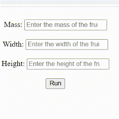

# Cloud Programming DLBSEPCP01_E
Deploying a Machine Learning Model with Terraform as Infrastructure as a Code (IaC) on Amazon Web Services (AWS)


## Prerequieries
Before you can use the magic of IaC, your computer must meet the following requirements:

1. Linux Distribution // Windows Subsystem for Linux (WSL): <br /> 
First, make sure you have a Linux Distribution to run the IaC template. If you're working with Windows, check the [Documentation on WSL](https://learn.microsoft.com/en-us/windows/wsl/) to set up a WSL.

2. AWS Account <br /> 
You will have to create an account at AWS to use this template. For further information, please visit the [official AWS website](https://aws.amazon.com/).
Make sure to also **download the AWS Command Line Interface (AWS CLI)** and **create an user in the Identity and Access Management (IAM)** with administrative access.

3. Terraform <br /> 
Next, you need to make sure Terraform runs on your PC. For downloading and setting up the tool please visit the [official website](https://www.terraform.io/).

4. Docker <br /> 
Last, you will need Docker to run on your PC. For download and documentation, please check the [official website](https://www.docker.com/). Make sure Docker is running when apply the IaC to AWS.

After following the above mentioned steps, you're good to go and run the terraform script.

You can get the code by either downloading the .zip-File or clone it via the command promt. For more information about the later please check the [github docs](https://docs.github.com/en/repositories/creating-and-managing-repositories/cloning-a-repository).


## Getting Started

Before you can upload your infrastructure to AWS, you'll need to login in the console with
```
aws configure
```
Insert your AWS Access Key ID and AWS Secret Access Key. 

Then run the following commands in the *infrastructure/* directory:
```
terraform init
```

If you want to see before hand what will be deployed, use the following command: 
```
terraform plan
```

To apply the infrastructure to AWS, use the following command:
```
terraform apply
```


##  The Structure

The code is structured as following:




## 

TODO

terraform apply -var-file="variables.tfvars"
